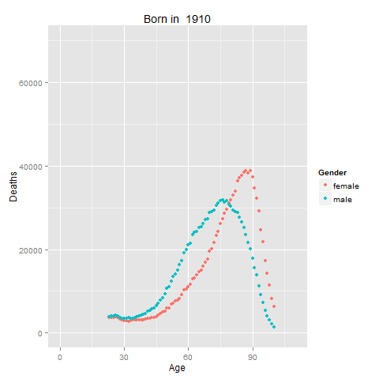
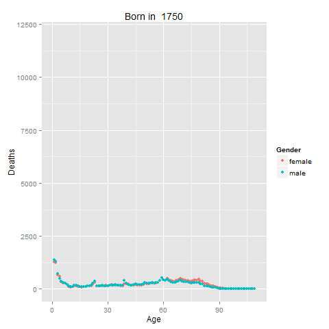

mortality
===========================

<html>
<body>

Detailed mortality rates given year of birth in the U.S. and Sweden.

Mortality in the U.S.A. Note large bumps in the male population's figures around 18-25 years of age for much of the measured time.</figcaption>

Mortality in Sweden, which has much more comprehensive records than the U.S. Note that the flu epidemic of 1918 is easily visible in the mortality rates of those born in the late 1890s through the middle of the first decade of the 1900s.

This analysis uses data from the Human Mortality Database at the University of California, Berkeley (USA), and the Max Planck Institute for Demographic Research in Germany (<a href="http://www.mortality.org">www.mortality.org</a> or <a href="http://www.humanmortality.de">www.humanmortality.de</a>). Data was downloaded on 16 December 2014.

</body>
</html>
